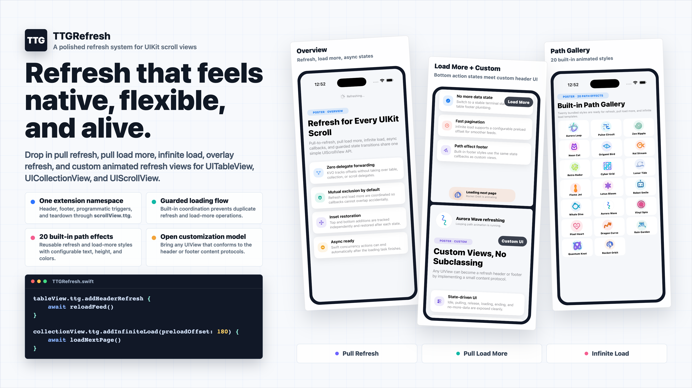
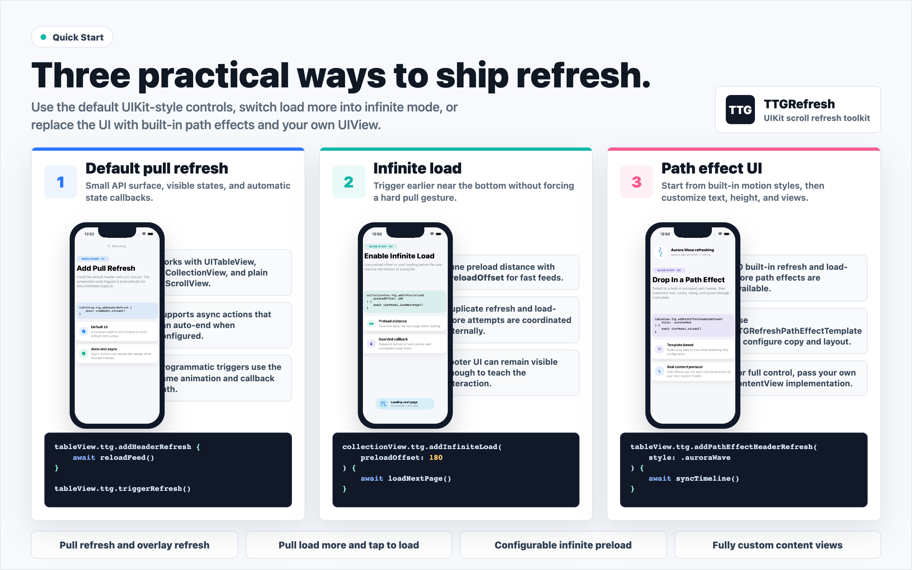
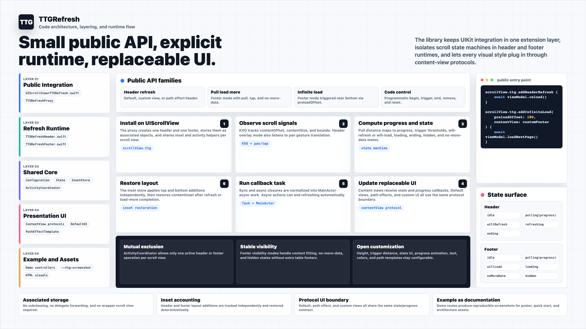

# TTGRefresh

TTGRefresh is a UIKit refresh toolkit for `UIScrollView`, `UITableView`, and `UICollectionView`. It provides pull refresh, pull load more, infinite load, overlay refresh, guarded async callbacks, tap-to-load footers, and fully replaceable refresh views through one `scrollView.ttg` namespace.



## Features

- Pull-to-refresh headers for table views, collection views, and plain scroll views.
- Pull load-more footers with tap-to-load support and no-more-data state.
- Infinite load with configurable `preloadOffset` for feed-style pagination.
- Programmatic refresh and load-more APIs that run the same animation and callback path.
- Built-in coordination to avoid duplicate refresh/load-more callbacks and accidental overlap.
- Content-inset and overlay header presentation modes.
- Default text UI, 20 built-in path effect styles, or any custom `UIView` content view.
- Swift concurrency support with optional automatic end-refresh behavior.

## Installation

### Swift Package Manager

```swift
.package(url: "https://github.com/zekunyan/TTGRefresh.git", from: "0.1.0")
```

### CocoaPods

```ruby
pod 'TTGRefresh'
```

## Quick Start



### Pull Refresh

```swift
import TTGRefresh

tableView.ttg.addHeaderRefresh {
    await viewModel.reload()
}
```

Callback-style actions are also supported. End them manually when work finishes:

```swift
tableView.ttg.addHeaderRefresh { [weak self] in
    self?.reloadFirstPage()
}

tableView.ttg.endHeaderRefreshing()
```

### Pull Load More

```swift
tableView.ttg.addFooterRefresh {
    await viewModel.loadNextPage()
}

tableView.ttg.endFooterRefreshingWithNoMoreData()
tableView.ttg.resetFooterNoMoreData()
```

Pull load-more footers can be tapped by default. Disable that behavior when a screen needs drag-only pagination:

```swift
var configuration = TTGRefreshConfiguration.default
configuration.isTapToLoadMoreEnabled = false

tableView.ttg.addFooterRefresh(configuration: configuration) {
    await viewModel.loadNextPage()
}
```

### Infinite Load

Use infinite load when the next page should start naturally near the bottom instead of requiring a hard pull gesture.

```swift
collectionView.ttg.addInfiniteLoad(preloadOffset: 180) {
    await viewModel.loadNextPage()
}
```

`preloadOffset` controls how early loading starts before the visible content reaches the bottom.

### Programmatic Control

```swift
tableView.ttg.triggerRefresh()
tableView.ttg.triggerLoadMore()

tableView.ttg.beginHeaderRefreshing(animated: true, triggerAction: true)
tableView.ttg.beginFooterRefreshing(animated: true, triggerAction: true)

tableView.ttg.endHeaderRefreshing()
tableView.ttg.endFooterRefreshing()
```

These entry points use the same state machine as user gestures, so UI, animations, and callbacks stay consistent.

## Built-In Path Effects

TTGRefresh includes 20 bundled path effect styles. Each style works as a refresh header, pull load-more footer, or infinite-load footer.

```swift
tableView.ttg.addPathEffectHeaderRefresh(style: .auroraWave) {
    await viewModel.reload()
}

tableView.ttg.addPathEffectFooterRefresh(style: .rocketOrbit) {
    await viewModel.loadNextPage()
}

collectionView.ttg.addPathEffectInfiniteLoad(style: .pulseCircuit, preloadOffset: 160) {
    await viewModel.loadNextPage()
}
```

Use `TTGRefreshPathEffectStyle.allCases` to build galleries or pick a bundled default.

## Customization

### Configuration

```swift
var configuration = TTGRefreshConfiguration.default
configuration.animationDuration = 0.25
configuration.minimumRefreshingDuration = 0.35
configuration.automaticallyChangeAlpha = true
configuration.minimumVisibleAlpha = 0.24
configuration.headerContentVerticalOffset = 36
configuration.hapticsEnabled = true
configuration.headerPresentationMode = .contentInset
configuration.footerVisibilityMode = .hiddenWhenContentFits
configuration.shouldAutoEndAsyncRefreshing = true
configuration.isTapToLoadMoreEnabled = true
```

Use overlay presentation for an Android-style header that appears inside the visible scroll area while the list content stays pinned:

```swift
var configuration = TTGRefreshConfiguration.default
configuration.headerPresentationMode = .overlay

tableView.ttg.addHeaderRefresh(configuration: configuration) {
    await viewModel.reload()
}
```

### Default Text

```swift
let header = TTGRefreshDefaultHeaderView(
    texts: TTGRefreshHeaderTextSet(
        idle: "Pull for updates",
        pulling: "Keep pulling",
        willRefresh: "Release now",
        refreshing: "Updating...",
        ending: "Done"
    )
)

tableView.ttg.addHeaderRefresh(contentView: header) {
    await viewModel.reload()
}
```

Footer text is configurable with `TTGRefreshFooterTextSet`.

### Path Effect Templates

```swift
let template = TTGRefreshPathEffectTemplate(
    style: .quantumKnot,
    headerPreferredHeight: 120,
    footerPreferredHeight: 82,
    footerContentWidth: 300,
    colors: [.systemCyan, .systemPurple],
    animationSpeed: 1.2,
    lineWidthScale: 1.1
)

tableView.ttg.addPathEffectHeaderRefresh(template: template) {
    await viewModel.reload()
}
```

Templates expose height, trigger distance, footer width, colors, animation speed, line width, and text providers.

### Fully Custom Views

Any `UIView` can become a refresh header or footer by conforming to a small content protocol.

```swift
final class CustomHeaderView: UIView, TTGRefreshHeaderContentView {
    var preferredHeight: CGFloat { 88 }
    var triggerHeight: CGFloat { 72 }

    func refreshHeaderDidChange(state: TTGRefreshHeaderState) {
        switch state {
        case .idle:
            // Reset labels and progress UI.
            break
        case .pulling(let progress):
            // Drive labels, alpha, scale, or path drawing with progress.
            _ = progress
        case .willRefresh:
            // Show the release-to-refresh state.
            break
        case .refreshing:
            // Start loading animation.
            break
        case .ending:
            // Stop loading animation.
            break
        }
    }

    func refreshHeaderDidUpdate(progress: CGFloat) {
        // Called continuously while the pull distance changes.
        _ = progress
    }
}

tableView.ttg.addHeaderRefresh(contentView: CustomHeaderView()) {
    await viewModel.reload()
}
```

Use `TTGRefreshFooterContentView` for custom footers. Header and footer views control their own `preferredHeight`, `triggerHeight`, state UI, and progress animation.

## State Model

Header states:

```swift
idle
pulling(progress:)
willRefresh
refreshing
ending
```

Footer states:

```swift
idle
pulling(progress:)
willLoad
loading
noMoreData
hidden
```

TTGRefresh coordinates header and footer activity for a scroll view so duplicate triggers and overlapping refresh/load-more callbacks are rejected by default.

## Architecture



TTGRefresh keeps the public surface small while separating runtime behavior from presentation. `UIScrollView+TTGRefresh.swift` installs headers and footers through associated objects, `TTGRefreshHeader` and `TTGRefreshFooter` own the scroll observation and state machines, and shared core helpers coordinate inset restoration and mutually exclusive activity. Default UI, built-in path effects, and fully custom views all plug in through the same content-view protocols.

## Example App

Open the UIKit demo project:

```bash
open Examples/TTGRefreshDemo/TTGRefreshDemo.xcodeproj
```

The demo includes:

- Main overview with default pull refresh and pull load more.
- Pull load-more and infinite-load examples.
- Overlay refresh presentation.
- Custom content view demo.
- Built-in path effect gallery.
- Screenshot-only routes used by the README assets.

Screenshot routes are launched with:

```bash
--ttg-screenshot posterOverview
--ttg-screenshot posterLoadMore
--ttg-screenshot posterCustomPaths
--ttg-screenshot posterPathGrid
--ttg-screenshot quickStartBasic
--ttg-screenshot quickStartInfinite
--ttg-screenshot quickStartCustom
```

## Development Checks

The shared `TTGRefreshDemo` scheme includes `TTGRefreshDemoTests`, which runs the package behavior tests on iOS Simulator. The tests cover default configuration, programmatic refresh/load-more triggering, duplicate-operation guards, header/footer mutual exclusion, async install paths, built-in path effect setup, and footer visibility edge cases.

Before publishing a release, run the Example scheme tests and CocoaPods lint:

```bash
pod lib lint --allow-warnings --skip-tests
```

## Visual Assets

README images are generated from real Simulator screenshots and HTML source files:

- `Resources/promo_poster_review.html`
- `Resources/quick_start_review.html`
- `Resources/architecture_review.html`
- `Resources/screenshots/*-hires.png`
- `Resources/promo_poster.png`
- `Resources/quick_start.png`
- `Resources/architecture_diagram.png`

Regenerate the final PNG assets with Playwright available to Node:

```bash
node scripts/render-html-assets.mjs
```

When using a system Chrome binary directly:

```bash
CHROME_PATH="/Applications/Google Chrome.app/Contents/MacOS/Google Chrome" node scripts/render-html-assets.mjs
```

The renderer outputs:

- `Resources/promo_poster.png` at `3840x2160`
- `Resources/quick_start.png` at `2880x1800`
- `Resources/architecture_diagram.png` at `3840x2160`

## License

TTGRefresh is available under the MIT license. See [LICENSE](LICENSE).
